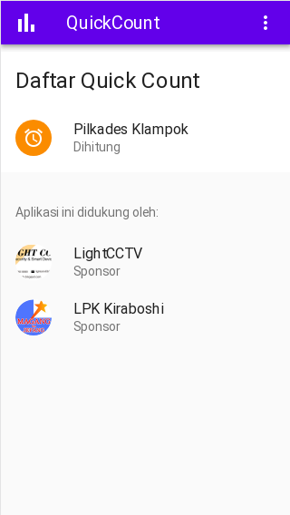
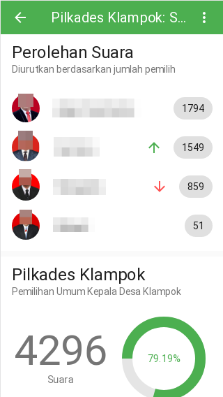
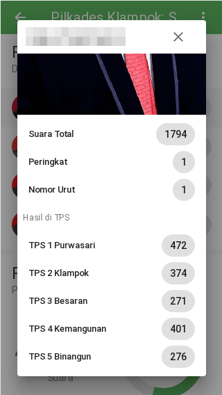
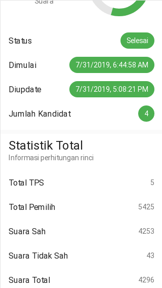
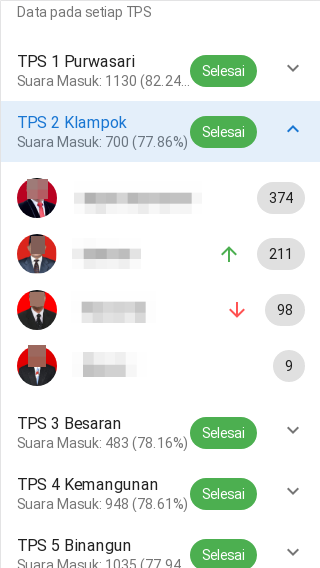
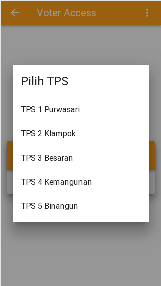
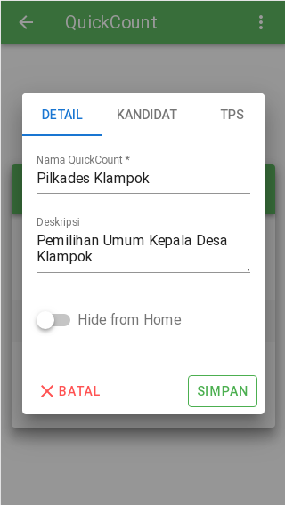
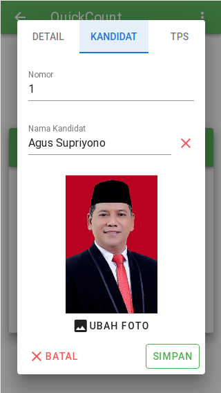
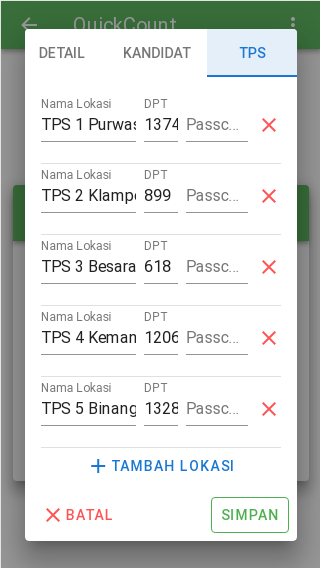

# QC Desa Client

    Aplikasi client untuk browser menggunakan VueJS.

    Aplikasi ini dapat gunakan atau di edit secara bebas dengan tidak mengubah/menghapus/mengurangi author dan sponsor pada halaman About.

*Contact: arifin@klampok.id klampok.child@gmail.com*

## Tips n Trik
### Konfigurasi API URL menggunakan `dotenv`

Kamu bisa mengubah konfigurasi `.env` tanpa di index oleh GIT dengan cara membuat
file `.env.local` atau `.env.development.local` atau `.env.production.local`.
[Baca Selengkapnya.](https://cli.vuejs.org/guide/mode-and-env.html#environment-variables)


Contoh file `.env.production.local`:
```
VUE_APP_API_URL=/api
VUE_APP_API_DIRECT_URL=http://qc.doman.desa.id:8888/api
```

### Contoh deploy.sh script

``` bash
#!/bin/bash

yarn build
rsync -rav --delete ./dist/ "server:/home/user/client"
exit 0
```

## Project setup
```
yarn install
```

### Compiles and hot-reloads for development
```
yarn run serve
```

### Compiles and minifies for production
```
yarn run build
```

### Deploy to Server

*For Linux Users Only*
Pastikan sudah di setting ssh menggunakan publickey dan sudah membuat file `deploy.sh` executable.

```
yarn run deploy
```

### Customize configuration
See [Configuration Reference](https://cli.vuejs.org/config/).

## Screenshot

### Halaman Pengunjung / Pemantau






### Halaman Voter


### Halaman Admin




